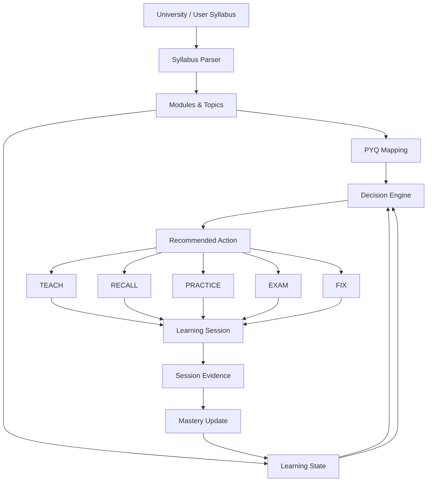

# TKM Notes

> An adaptive university exam-learning platform that transforms syllabus, PYQs, mastery, mistakes, and study time into personalized learning sessions.

Built for TKM College of Engineering, KTU 2024 scheme, Semesters S3–S8.

---

## Problem

Engineering students typically have all the raw material and none of the direction:

- a large official syllabus with little structure for revision
- scattered notes that don't reflect exam weightage
- previous-year questions with no clear topic mapping
- topics they *think* they know but consistently get wrong
- limited preparation time

Nobody tells them what to study **next**. They guess, or they re-read everything, or they
avoid the weak modules entirely. TKM Notes replaces that guesswork with a decision engine
that reads their syllabus, PYQs, mastery, mistakes, and revision state, and returns one
recommended action with a stated reason.

## Core Learning Loop

```text
ASSESS
   ↓
PRIORITIZE
   ↓
LEARN
   ↓
RECALL
   ↓
PRACTICE / PYQ
   ↓
CHECK
   ↓
FIX
   ↓
UPDATE MASTERY
   ↓
RECOMMEND NEXT ACTION
```

The loop is closed: every session ends in recorded evidence, evidence updates mastery, and
mastery drives the next recommendation.

## How It Works

1. **Syllabus provides the academic structure.** The official KTU syllabus is imported into a
   versioned store. Modules and topics are the unit of study, and the syllabus is the source
   of truth — not notes, not prompts.
2. **PYQs provide exam relevance.** Questions map to topics, so a topic's priority reflects how
   often it has actually been asked rather than how interesting it reads.
3. **Learning State tracks the student.** Per topic: mastery (0–6), exposure, last studied, and
   revision-due timestamps. Per subject: open mistakes and a bounded session log.
4. **Decision Engine selects the next action.** `decideNextAction()` is a pure, deterministic
   function. It resolves open mistakes to `FIX`, due revisions to `RECALL`, weak-but-started
   topics to `PRACTICE`, unstarted topics to `TEACH`, and falls back to `EXAM` when a subject is
   broadly assessed. It returns the task, the topic, and a human-readable reason.
5. **Session Planner converts the action into a time-boxed session.** `planSession()` distributes
   the chosen duration across task-specific steps that sum exactly to the budget.
6. **Prompt Engine creates contextual study instructions.** The task, topic, syllabus titles,
   topic states, mistakes, and mapped PYQs are assembled into a structured prompt. `TEACH` uses
   the Zero→Pro teaching chain; `EXAM` uses the high-yield exam pack.
7. **Evidence updates mastery.** The student records how the session went. Only that outcome
   writes evidence — never opening a lesson or starting a session.
8. **The next recommendation is recalculated** from the updated state.

## Key Engineering Features

- **Versioned syllabus system** — official, user-pasted, and user-edited versions with an
  explicit active version; a paste never silently replaces the canonical official syllabus.
- **Program-scoped academic identity** — course codes are *not* globally unique (`24CSP304` exists
  in two programmes), so identity is always `(programId, subjectCode)` via namespaced stable ids.
- **Deterministic recommendation engine** — same state in, same recommendation out. No
  randomness, no clock dependence, no hidden heuristics; every recommendation carries its reason.
- **Mastery model 0–6** — evidence-weighted, with deliberately small deltas so no single
  interaction can jump a topic to "mastered".
- **Mistake tracking** — open mistakes outrank all other signals until a `FIX` session resolves them.
- **Revision scheduling** — topics carry a revision-due timestamp that routes to `RECALL`.
- **PYQ mapping** — questions map to topics via significant-token overlap (a link requires at
  least two shared non-stopword tokens), and actual questions stay distinguishable from
  PYQ-based variations and new practice material. Mapped counts feed topic priority.
- **Session planning** — deterministic minute allocation per task shape, summing exactly to budget.
- **Contextual prompt generation** — provider-agnostic structured prompts assembled from real state.
- **localStorage persistence** — no backend, no account, no network calls at runtime.
- **TypeScript domain model** — strict mode, shared ID helpers, no `any` in domain code.
- **Automated tests** — 159 tests across 14 Vitest suites covering identity, syllabus, decision, mastery, sessions, prompts, and data integrity.

## Architecture



**Layered view:**

```text
UI (app/, components/subject/)
        ↓
Learning Engine (lib/learning/)      decision · session · mastery
        ↓
Decision Engine (lib/learning/decision.ts)
        ↓
Learning State (lib/learning/state.ts)          localStorage
        ↓
Syllabus (lib/syllabus/) · PYQs (lib/pyqs.ts) · Notes (lib/notes/)
        ↓
Prompt Engine (lib/learning/prompts/)
```

Full detail: [`docs/ARCHITECTURE.md`](docs/ARCHITECTURE.md).

### Session lifecycle

```text
Continue Learning  →  (no session created)
   ↓
Session Overview   →  (no session created)
   ↓
Start Session      →  startSession() — exactly one record
   ↓
Active Session     →  contextual prompt generated
   ↓
Optional Study with AI → copy prompt, open ChatGPT / Gemini / Claude (same session)
   ↓
Finish Session     →  completes that same record; records evidence
   ↓
Mastery updated + next recommendation shown
```

`startSession()` is idempotent per plan id and `finishSession()` completes the existing record
rather than appending a second one, so refreshes and double-clicks cannot duplicate records.
Opening an external AI assistant does not start or finish a session.

## Mastery Model

Mastery is a 0–6 integer, and it is deliberately hard to move.

- **Opening a topic does not create mastery.** It marks exposure only; mastery stays `null`.
- **Reading a lesson does not imply mastery.** `TEACH` sessions record exposure, not proof.
- **Starting a session awards nothing.** No evidence, no mastery change.
- **Evidence drives mastery.** Recall, practice, PYQ, and self-check results move the number.
- Outcomes map to evidence: `strong` → correct, `partial` → partial, `struggled` → incorrect.
- Different evidence kinds move mastery by different amounts — recall and PYQ move it fastest,
  self-check slower — so repeated exposure alone cannot reach the top of the scale.

Unassessed is a real state and is displayed as such. "0%" means genuinely unassessed, not failed.

## External AI Study

TKM Notes generates context-aware study prompts and can hand them off to external AI assistants.
It does **not** currently run its own LLM.

```text
TKM Notes
→ contextual prompt
→ copy prompt
→ external AI (ChatGPT, Gemini, or Claude)
→ study
→ return to TKM Notes
→ finish session
→ evidence
→ mastery
```

Choose **Open ChatGPT**, **Open Gemini**, or **Open Claude** in an active session. The prompt is
copied to the clipboard and the official site opens in a new tab. Paste the prompt into that chat
to begin. TKM Notes does not insert the prompt into the external conversation.

If clipboard access fails, the assistant still opens; copy the prompt from the session page.

When syllabus information is uncertain, generated prompts instruct the external AI to verify
against official TKM College of Engineering sources (`https://tkmce.ac.in/`) when web access is
available. Prompts do **not** tell the assistant to search that site before every answer.

This is a deliberate architectural choice, not a missing feature:

- no API keys, no per-request cost, no vendor lock-in
- the prompt is fully inspectable and editable before use
- the product makes no claim to generate AI answers itself
- the learning loop stays intact: evidence still comes from the student's own performance

`/prompt-lab` remains available as an advanced, manual tool for building custom prompts outside
the recommended flow.

## Tech Stack

| Layer | Choice |
|---|---|
| Framework | Next.js `14.2.35` (App Router, static generation) |
| UI | React `^18.3.1` |
| Language | TypeScript `^5.5.4` (strict) |
| Styling | Tailwind CSS `^3.4.7` + CSS-variable design tokens |
| Tests | Vitest `^2.1.9` |
| Linting | ESLint `^8.57.1` + `eslint-config-next` `^14.2.35` |
| State | React state + `localStorage` (no Redux/Zustand) |
| Data | Static typed `.ts` files (no DB, no runtime API) |
| Deploy | GitHub → Vercel |

## Testing

```bash
npm test                 # Vitest — 159 tests across 14 suites
npm run lint             # ESLint via next lint
npx tsc --noEmit         # TypeScript strict type check
npm run build            # Production build (1607 static pages)
```

Additional data-integrity validators:

```bash
npm run validate:content     # Content counts, collisions, registry checks
npm run validate:syllabus    # Syllabus + Learn CS integrity (exit 0 = all pass)
npm run import:syllabus      # Regenerate lib/syllabusData.ts (idempotent)
```

The syllabus importer is idempotent by design: two consecutive runs produce byte-identical
output, and a test asserts this so a regeneration can never silently drift.

## Screenshots

> **TODO — not yet committed.** The following are the highest-value captures for a recruiter:
>
> 1. Subject page showing the **Continue Learning** card with recommendation + reason
> 2. `/learn` session overview with the time-boxed plan
> 3. Active session with the generated prompt and copy button
> 4. Post-session evidence screen showing mastery change and the next recommendation
> 5. Syllabus manager showing official vs user-pasted versions

## Roadmap

Short and honest.

- **Expand written notes** — coverage is currently ~28 of 259 subjects; the learning engine
  already works without notes, so this is content, not architecture.
- **Export / import learning state** — progress is `localStorage`-only, so it does not follow the
  student across devices. A JSON export/import is the cheapest meaningful unlock.
- **Stronger PYQ confidence** — current mapping is token-overlap based and gated on a two-token
  minimum, but it emits no graded confidence. Emitting a `high`/`medium`/`low` confidence on each
  link (and downgrading weak links to a *suggested* mapping) would stop thin overlaps from reading
  as authoritative.
- **Multi-programme recommendation ranking** — the engine already reads branch preference; a
  weighted version that optimises across a whole branch is a natural extension.

Explicitly **not** planned: an embedded LLM tutor, accounts/social features, gamification, or
additional study modes.

## Status

**Implemented and tested:**

- versioned syllabus system (official / pasted / edited, active version, module parsing variants)
- program-scoped domain model with stable subject / module / topic ids
- deterministic decision engine across all five tasks
- time-boxed session planner with exact minute budgets
- evidence-based 0–6 mastery model
- mistake tracking with `FIX` resolution
- revision-due scheduling driving `RECALL`
- PYQ → topic mapping via significant-token overlap; actual questions stay
  distinguishable from PYQ-based variations and new practice material, and mapped counts
  drive topic priority
- contextual prompt generation for all five tasks
- single-obvious-action subject UX (Continue Learning) with a clean session lifecycle
- 159 automated tests, clean lint, clean type check, 1607-page production build

**Not implemented:**

- no backend, no database, no authentication
- no real LLM calls — prompts are generated client-side for copy/paste
- no multi-device sync (state is per-browser `localStorage`)
- no analytics, PWA/offline support, or i18n
- written notes for ~231 of 259 subjects (subjects without notes still work through the syllabus)

## Author

**Sreerang** — TKM College of Engineering

<p align="center">
  <a href="https://github.com/cosmiccoder200x-sys">
    
  </a>
</p>

Repository: [`cosmiccoder200x-sys/TKM-Notes`](https://github.com/cosmiccoder200x-sys/TKM-Notes)
