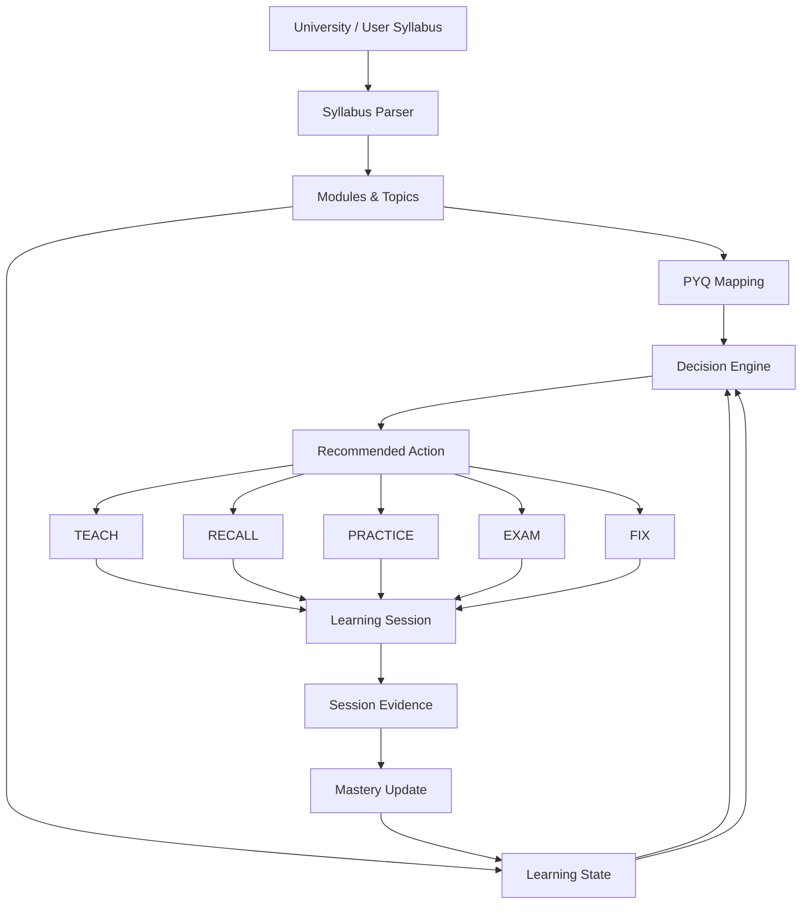

# Architecture — TKM Notes

This document describes the **implemented** system in `cosmiccoder200x-sys/TKM-Notes`, not a target
design. Where the implementation is weaker than the concept, this document says so.

---

## 1. Product architecture

TKM Notes is a **static Next.js application** with no backend, no database, and no runtime API
calls. All academic content is typed TypeScript data compiled at build time. All student state
lives in `localStorage` on the student's own device.

The product exists to answer one question: **what should this student study next, and why?**
Everything else — syllabus, PYQs, notes, prompt generation — exists to produce a defensible answer.

### System flow



### Layered view

```text
UI — app/, components/subject/
      │
      ▼
Learning Engine — lib/learning/
  ├── decision.ts     what to do next
  ├── session.ts      turn an action into a timed session
  ├── mastery.ts      evidence → mastery
  ├── state.ts        read/write learning state
  └── pyqmap.ts       questions → topics
      │
      ▼
Content Sources
  ├── lib/syllabus/   versioned syllabus store
  ├── lib/pyqs.ts    question bank
  ├── lib/notes/      authored notes
  └── lib/domain.ts   canonical identity
      │
      ▼
Prompt Engine — lib/learning/prompts/
```

**The dependency direction matters:** content sources know nothing about the learning engine, and
the learning engine never imports React. `lib/learning/*` is pure, synchronous, and testable
without a DOM.

---

## 2. Domain model

`lib/domain.ts` is the single source of truth for academic identity. The hierarchy is:

```text
Program → Scheme → Semester → Subject → Module → Topic
```

### Stable identifiers

Course codes are **not globally unique** — `24CSP304` is *Algorithms* in CSE and *Data Structures
and Algorithms* in CSE [AI]. Every identifier is therefore namespaced by program:

| Helper | Output | Purpose |
|---|---|---|
| `subjectId(program, code)` | `ER:24ERP304` | program-scoped subject identity |
| `moduleId(subjectKey, "m1")` | `ER:24ERP304:m1` | module codes never collide across subjects |
| `topicId(subjectKey, "m1", 3)` | `ER:24ERP304:m1:3` | topic slot within a module |

`parseSubjectId` / `parseModuleId` reverse these, and legacy `CSE:` / `CSE_AI:` prefixes migrate
on read. All progress, session, mistake, note, and PYQ state is keyed off `(programId, subjectCode)`.

`lib/urls.ts` and `lib/branch.ts` derive their program metadata from `domain.ts`; no subsystem
duplicates a program or semester table.

---

## 3. Syllabus system

`lib/syllabus/` owns syllabus ingestion. It does **not** assume notes exist — the engine works on
syllabus alone.

### Versions and sources

Every subject has a list of `SyllabusVersion` records, each with a `source`:

| Source | Meaning |
|---|---|
| `official` | imported from the committed KTU 2024 JSON |
| `user_pasted` | parsed from text the student pasted |
| `user_edited` | derived from a previous version by student edits |

Exactly one version is `active`. `getEffectiveModules(programId, subjectCode)` resolves the active
version and is the **only** accessor the engine uses — so a pasted syllabus can never silently
replace the official one, and the source is always displayable.

### Parsing

`parse.ts` normalises free-form pasted text into modules and topics. It recognises the heading
variants that appear in real university documents — `MODULE I`, `MODULE 1`, `Module 1`, `UNIT I`,
`UNIT-1`, `Unit 1`, `I.`, `1.` — and treats a module with no sub-headings as a topic-less module
(the engine handles both shapes via `topicIndex: null`).

`export.ts` renders a version back to plain text for the copy-syllabus action.

### Official data pipeline

```text
data/syllabus/*.json  →  scripts/import-syllabus.mjs  →  lib/syllabusData.ts  →  getEffectiveModules
```

The importer resolves sources repo-relative (portable — no absolute developer paths) and is
**idempotent**: two consecutive runs produce byte-identical output, asserted by
`tests/import-idempotent.test.ts` so regeneration can never drift silently.

---

## 4. Learning state

`lib/learning/state.ts` owns all student state under a single key, `tkm.v2.learning.v1`:

```ts
type Store = Record<string /* "ER:24ERP304" */, SubjectLearningState>;

interface SubjectLearningState {
  subjectKey: string;
  programId: ProgramId;
  subjectCode: string;
  topics: Record<string /* topicId */, TopicLearningState>;
  mistakes: MistakeRecord[];      // capped at 50
  sessions: StudySessionRecord[];  // capped at 20
  updatedAt: number;
}
```

Per topic: `mastery` (`0–6` or `null`), `exposed`, `revisionDueAt`, `lastStudiedAt`, `moduleCode`,
`topicIndex`, `title`.

**`mastery: null` is a real, distinct state** meaning *unassessed*. It is not the same as `0`
(which means assessed and failed). The UI displays the difference honestly.

All reads/writes go through `safeRead` / `safeWrite`, which degrade silently if storage is
unavailable (private browsing, quota) rather than throwing during render.

---

## 5. Decision Engine

`lib/learning/decision.ts` — `decideNextAction(programId, subjectCode, minutes)`.

**Pure and deterministic.** Same state in, same recommendation out. No randomness, no network, no
clock beyond the `revisionDueAt <= now` comparison. This is what makes it directly testable.

It builds a flat list of `Unit`s (one per topic, or one per module where the syllabus has no
sub-topics) carrying `mastery`, `exposed`, `revisionDue`, and `pyqs`, then applies a **strict
priority cascade** — the first rule that matches wins:

| # | Condition | Task | Reason returned |
|---|---|---|---|
| 0 | no units (no syllabus) | `teach` | "Open the syllabus and start Module 1." |
| 1 | open mistake on a unit with `mastery < 4`, newest first | `fix` | "Fix your mistake in {topic}." |
| 2 | any unit with `revisionDue`, lowest mastery first | `recall` | "{topic} is due for revision." |
| 3 | any unit with `mastery !== null && < 4`, most PYQs then lowest mastery | `practice` if mastery ≥ 2 else `teach` | "High exam weight + low mastery. Practice {topic}." |
| 4 | any unit never assessed | `teach` | "Next in your syllabus: {topic}." |
| 5 | everything assessed | `exam` | "Everything is assessed — run a mastery check on {topic}." |

**Mistakes outrank everything** (rule 1) because an unfixed mistake is active evidence of a gap,
whereas low mastery is only a weak signal. Within rule 1, mistakes are filtered to
`mastery < 4` — re-drilling a topic the student has already mastered is waste, so those fall
through to the next rule.

**PYQ counts break ties, they do not create priority.** A high-PYQ topic is worth more than an
equally-weak low-PYQ topic, but a topic with no PYQs is still studied if it is weak.

Every return value carries a human-readable `reason` that states the actual rule that fired. The UI
renders `reason` verbatim — it never composes its own explanation, so the displayed justification
cannot drift from the logic that produced it.

---

## 6. Session lifecycle

`lib/learning/session.ts`.

```text
Continue Learning  (decision only — no session created)
   ↓
Session Overview   (plan built — no session created)
   ↓
Start Session  →   startSession()   exactly one record
   ↓
Active Session     (prompt shown for copy/paste)
   ↓
Finish Session →   finishSession()  completes that record + records evidence
   ↓
Mastery updated, next recommendation recomputed and shown
```

### Plan

`planSession(action, minutes, ...)` produces a `StudySessionPlan` with a unique `id` and a step
list. Steps are task-shaped (`SHAPES`) and minute-weighted (`WEIGHTS`); the weights are rounded to
whole minutes and the **remainder is added to the last step**, so the step minutes always sum
exactly to the requested budget. Verified by test.

### Exactly-once guarantees

This was the highest-priority correctness issue in the codebase, and the fixes are structural
rather than incidental:

- `StudySessionRecord` carries a **`planId`**, correlating a record to the plan that created it.
- `logSession()` is **idempotent per `planId`** — if a record for that plan already exists it is
  returned unchanged. A double-click on *Start Session*, or a re-render, cannot create a second
  record.
- `finishSession()` calls `completeSession()`, which **stamps `finishedAt` on the existing
  record** rather than appending a new one. Previously finishing logged a second, separate record,
  so a single session appeared twice in history. If no started record exists it falls back to
  logging one, which keeps direct `finishSession()` calls (tests, edge paths) correct.
- `finishSession()` begins with an **`isSessionFinished()` guard** and returns
  `{ resolvedMistakes: 0, duplicate: true }` without touching state. This matters because
  evidence and mistake resolution used to run *before* the completion check, so a second call
  re-applied evidence (inflating mastery by up to +2) and re-resolved the same mistake. Guarding
  first makes the whole effect idempotent, not just the record list.
- The **time selector is disabled once a session starts**. It used to re-plan on change, which
  generated a new `planId` mid-session and orphaned the already-started record as permanently
  unfinished.

Regression tests in `tests/learning-engine.test.ts` (*session lifecycle regression*) assert exactly
one record after start, exactly one after start + finish + finish-again, unchanged mastery on
re-finish, and that a re-finished `fix` session does not resolve the same mistake twice.

---

## 7. Mastery model

`lib/learning/mastery.ts` — `applyMasteryEvidence(current, evidence)`, scale **0–6**.

| Mastery | Label |
|---|---|
| `null` | Not Started (unassessed — **not** a score of zero) |
| 0 | Not Started |
| 1 | Familiar |
| 2 | Basic Understanding |
| 3 | Standard Problem Solving |
| 4 | Exam Ready |
| 5 | Independent Mastery |
| 6 | Advanced |

### Evidence rules

```ts
taught                 → no change (exposure only)
reviewed               → null ? 1 : unchanged
done                   → no change
partial                → no change
incorrect              → −1 (and null → 0)
correct pyq            → +2
correct practice       → +2 if hard, else +1
correct (other)        → +1
```

Clamped to `[0, 6]`.

The design intent is that **mastery is expensive to fake**:

- `taught` — a `TEACH` session — changes nothing. Being told something is not evidence of knowing it.
- `partial` is deliberately worth **zero**, not a half-step. A partial result is not evidence of
  progress; treating it as fractional credit let sessions inflate mastery without proving anything.
- PYQ correctness moves the most (+2) because it is the hardest signal to fake and the most
  predictive of exam performance.
- The smallest useful step is +1, so reaching 5 or 6 takes sustained, repeated, correct evidence
  across multiple sessions. There is no shortcut from exposure to mastery.

### Outcome → evidence mapping

`finishSession` translates the student's self-assessment into evidence:

| Task | Evidence kind | strong | partial | struggled |
|---|---|---|---|---|
| `teach` | `selfcheck` | correct | partial | incorrect |
| `recall` | `recall` | correct | partial | incorrect |
| `practice` | `practice` | correct | partial | incorrect |
| `exam` | `pyq` | correct | partial | incorrect |
| `fix` | `practice` | correct | partial | incorrect |

A correct `recall` or `reviewed` also clears `revisionDueAt`, which is what removes a topic from the
`recall` branch of the decision cascade and lets it progress.

---

## 8. Mistake system

Mistakes are first-class, separately tracked records — not a mastery decrement. A mistake survives
mastery changes and must be explicitly resolved.

```ts
interface MistakeRecord {
  id: string;
  topicRef: string;
  topicTitle: string;
  note: string;
  createdAt: number;
  resolved: boolean;
}
```

Capped at 50, newest first. `openMistakes(state)` filters to unresolved.

Resolution: a `fix` session with outcome `strong` or `partial` resolves all open mistakes on that
topic and returns `resolvedMistakes` for display. A `struggled` outcome leaves them open, so the
next decision still routes to `fix`.

Keeping mistakes separate from mastery is what lets the engine prefer *repair* over *re-teaching*:
a student can have respectable mastery on a topic and still owe a specific correction.

---

## 9. PYQ mapping

`lib/learning/pyqmap.ts` — `mapPyqsToTopics(programId, subjectCode)`.

For each question in the bank, tokenise (lowercase, strip punctuation, drop a stop-word list,
discard tokens ≤ 2 characters) and score against every topic title, keeping the single best match.
**A link requires at least two shared significant tokens** (`shared < 2 → 0`), which suppresses
incidental single-word overlap. Mapped links are program-scoped, so the same code in two programmes
never borrows the other's questions.

`topicPyqCounts()` aggregates links per topic; the decision engine uses these counts to break ties.

### Honest limitations

- Matching is **token overlap, not semantic**. A question phrased entirely in synonyms will not
  map, even when it is obviously about the topic.
- Links carry **no graded confidence**. A thin two-token overlap is emitted with the same apparent
  authority as a strong match.
- Where a module has no sub-topics, mapping falls back to module level with `topicIndex: null`.

The distinction between **ACTUAL PYQ**, **PYQ-based variation**, and **NEW practice** is
preserved in the prompt pipeline so a student is never shown a generated variation while believing
it is a real past-paper question.

---

## 10. Prompt Engine

`lib/learning/prompts/` — `buildTaskPrompt(task, context)` returns a structured prompt plus its
text. Shared study instructions live in `lib/learning/prompts/instructions.ts` and are composed
once into every task prompt (not copied per TEACH/RECALL/PRACTICE/EXAM/FIX). Prompt Lab
`generatePrompt()` composes the same block.

The student can copy the prompt or use **Study with AI** (`lib/learning/external-ai.ts`): copy,
then open ChatGPT (`https://chatgpt.com/`), Gemini (`https://gemini.google.com/`), or Claude
(`https://claude.ai/`) in one new tab. The app never injects prompt text into those URLs and
never claims the external chat was pre-filled. The app calls no LLM.

When syllabus information is unclear or uncertain, the prompt tells the assistant to verify
against `https://tkmce.ac.in/` if web access is available — it does not require a search before
every answer. The assistant may only claim a TKMCE check if it actually accessed that source.

### Context assembled

```text
college · university · program · scheme · semester · course · module · topic
syllabus source (official | user_pasted | user_edited)
learning task · available minutes
syllabusTitles · topics (with mastery / mistakes / revisionDue)
open mistakes · mapped PYQs · priority
```

### The five tasks

| Task | Architecture | Intent |
|---|---|---|
| `TEACH` | **Zero → Pro** chain | 14 ordered steps: prerequisites → intuition → core definition → mechanism → formal theory → formulas → derivation → worked example → guided problem → independent problem → PYQ application → challenge → active recall → mastery check |
| `RECALL` | retrieval-first | closed-book recall, self-graded, spaced-repetition aware |
| `PRACTICE` | problem set | guided → independent, with error review |
| `EXAM` | **high-yield exam pack** | 30-second core idea → must-know definitions → must-know formulas → step-by-step concepts → high-yield derivations → numerical blueprint → PYQ intelligence → examiner traps → active recall → emergency cheat sheet |
| `FIX` | repair | diagnose the specific mistake → repair the reasoning → verify with a variant |

The Zero→Pro and high-yield exam architectures are preserved as first-class prompt shapes, not
simplified into a generic template. Every task prompt also carries the subject-category guidance
from `lib/prompts/context.ts` (problem guidance, evaluation criteria, answer structure) and the
subject-specific `getSubjectCategory` heuristics.

### Legacy mode mapping

`TASK_FOR_MODE` (`lib/learning/prompts/types.ts`) maps the original 11 prompt-lab modes onto these
five tasks, and `MODE_FOR_TASK` (`lib/learning/continue.ts`) maps back. `/prompt-lab` and the new
engine therefore share one architecture instead of two parallel ones.

---

## 11. Persistence

| Store | Key | Scope |
|---|---|---|
| Learning state | `tkm.v2.learning.v1` | per `programId:subjectCode` |
| Syllabus versions | `tkm.v2.syllabus.v1` | per `programId:subjectCode` |
| Study progress (legacy) | `tkm.study.progress.v1` | per `programId:subjectCode` |
| Learn CS progress | `tkm.learncs.progress.v1` / `.detail.v1` | isolated from branch state |
| Branch preference | `tkm.branch.pref` | global |

Syllabus versions and learning state are **separate stores on purpose**: the syllabus is academic
content that may be shared or regenerated, while learning state is personal history. A syllabus
regeneration must never wipe a student's progress, and deleting progress must not discard a
pasted syllabus.

There is no server, so **progress does not follow the student across devices**, and clearing site
data clears progress. JSON export/import is the cheapest meaningful improvement and is listed in
the roadmap.

---

## 12. UI flow

### Subject page — `/syllabus/[program]/[semester]/[subject]`

```text
Subject header (breadcrumb, code, credits)
   ↓
Syllabus strip          — source label, copy syllabus, manage
   ↓
Continue Learning       — THE primary action
   ↓
Progress bar            — secondary
   ↓
Modules                 — grid / accordion
   ↓
PYQs                    — collapsed disclosure + full-bank link
   ↓
Notes / Resources       — secondary
```

**Continue Learning is the only primary action.** It displays progress, the recommended
`task → topic`, the decision engine's `reason` rendered verbatim, an estimated duration, and a
single CTA.

The CTA **navigates to `/learn` and creates nothing** — it does not call `startSession()`, and it
does not route to Prompt Lab. Session creation happens only on an explicit *Start Session* click.
This was the duplicate-session bug; the regression tests now lock it.

The previous choice-heavy interface (a mode switcher with Learn/Practice/Exam/Revise, a
tools grid, and competing CTAs) was removed as choice overload. The underlying tools kept working
as secondary routes.

### Session route — `/syllabus/[program]/[semester]/[subject]/learn`

```text
Phase "overview"  → Goal · Task · Time selector (15/30/45/60) · Why this? · Session plan
                     [ Start Session ]
        ↓
Phase "active"    → Generated prompt + copy button + honest framing
                     ("Work through this in your preferred AI assistant, then return here.")
                     [ Session complete ]
        ↓
Phase "done"      → How did you perform?  [Strong] [Partial] [Struggled]
        ↓
Recorded          → outcome saved · mistakes resolved · "Mastery updated from evidence"
                     NEXT UP: task → topic, with the next reason
                     [ Back to subject ]
```

Changing the time re-plans the session and returns to `overview`; it does not create or mutate a
session record. The selector is **disabled outside `overview`**, so time cannot change after a
session has started and orphaned its record.

---

## 13. Testing strategy

159 tests across 14 Vitest suites. The emphasis is **pure-function correctness of the learning
engine**, because that is where an incorrect answer silently misleads a student.

| Suite | Covers |
|---|---|
| `learning-engine` | decision cascade, plan minute sums, session lifecycle (no duplicates), mastery from evidence only, mistake resolution, program isolation |
| `learning-mastery` | evidence transitions, 0–6 clamping, no inflation from teaching |
| `learning-prompts` | all five task shapes, context assembly, Zero→Pro and exam-pack integrity |
| `syllabus` | official/pasted/edited versions, activation, module-heading variants, copy export |
| `pyqs` | mapping, program scoping, actual-vs-variation distinction |
| `domain` | stable id construction and parsing, program normalisation |
| `subjects` / `notes` | catalog integrity, registry keys, no cross-program collisions |
| `progress` | legacy progress and session isolation |
| `search` | hit labelling, `tkm` vs `learn-cs` discrimination |
| `learn-cs` | catalog integrity, mapping |
| `import-idempotent` | importer produces byte-identical output across runs |

`localStorage` is mocked per test with a `Map`-backed stub, so state is fully isolated between
tests and the suite runs in any order.

```bash
npm test              # 159 tests / 14 suites
npm run lint          # ESLint
npx tsc --noEmit      # strict type check
npm run build         # 1607 static pages
```

---

## 14. Architectural decisions and rationale

| Decision | Why |
|---|---|
| **Static export, no backend** | Zero cost, zero latency, no auth, no data collection. A study tool for one college does not need a server. The cost is no cross-device sync, which is an acceptable, stated trade. |
| **`localStorage` for state** | Removes the entire auth/account problem. Keeps the deployed app free. Isolates student data to the student's own device. |
| **Deterministic decision engine** | A recommendation that changes on every render is unexplainable and untestable. Determinism lets us assert the cascade in unit tests and lets the UI state its reason truthfully. |
| **Strict priority cascade** | An explainable, ordered rule set is auditable. It is weaker than a learned model but every recommendation can be justified in one sentence, which is the product's core promise. |
| **Evidence-based mastery, not completion-based** | The failure mode of study apps is rewarding the *appearance* of progress. Tying mastery only to assessed evidence means the number reflects capability, and `partial` scoring zero prevents inflation. |
| **Mastery and mistakes as separate stores** | A mistake is a specific, correctable defect; mastery is a broad capability estimate. Collapsing them loses the ability to prefer repair over re-teaching. |
| **Versioned syllabus store** | University syllabi change. Versioning means a paste can be reviewed and activated deliberately, and the official version is never silently destroyed. |
| **Program-scoped identity** | Real data proved course codes are ambiguous across programmes. Namespacing ids everywhere prevents an entire class of cross-branch data bleed. |
| **Idempotent importer** | A generated file that drifts on every run is a liability. Byte-identical reruns make the pipeline safe to re-run at any time. |
| **Provider-agnostic prompts** | No API key, no per-request cost, no vendor lock-in, and the student sees and can edit the exact prompt. The trade is no automatic feedback loop, which is stated plainly rather than implied away. |
| **Syllabus as source of truth, notes as optional** | Notes cover ~28 of 259 subjects. Making the engine syllabus-first means every subject works today, and notes become an enhancement instead of a blocker. |
| **No graded PYQ confidence** *(known gap)* | Token-overlap mapping is a heuristic. Emitting a confidence value would let weak matches be presented as suggestions rather than facts. Not yet implemented. |
